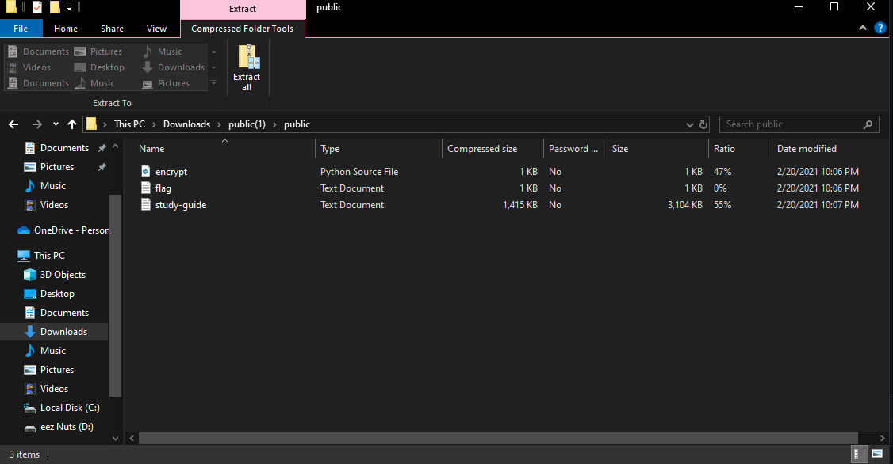

spelling-quiz is a medium difficulty crypto challenge that requires you to download a zip file and decrypt a flag hidden in the folder. 

when I extracted the contents of the folder, I was greeted with 3 files to explore. 

Now, for this challenge in particular, I didn't actually need to use the python script or change anything about it to find the correct study guide, or even use the study guide at all. I just went straight to the "flag" file and noticed that it was a string of words that seemed to be encrypted with a vigenere cipher. 

  `brcfxba_vfr_mid_hosbrm_iprc_exa_hoav_vwcrm` was the flag encrypted, and I decided to perform a frequency attack to figure out the most commonly used letter. 

  When doing a further analysis, I notice that r is the most commonly used letter in the string of characters, so I associate r = e and put this string of characters into   quipqiup. 

When I input the string, I get this as the top suggestion: 
`perhaps_the_dog_jumped_over_was_just_tired`

So, after this, I try to input the flag as 
`picoCTF{perhaps_the_dog_jumped_over_was_just_tired`

When I input this in, it solves the challenge!
