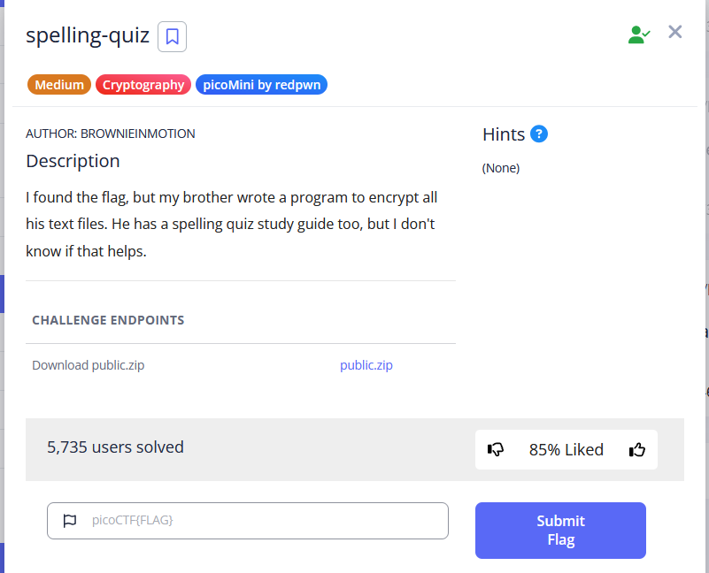

spelling-quiz is a medium difficulty crypto challenge that requires you to download a zip file and decrypt a flag hidden in the folder. 

when I extracted the contents of the folder, I was greeted with 3 files to explore. 

